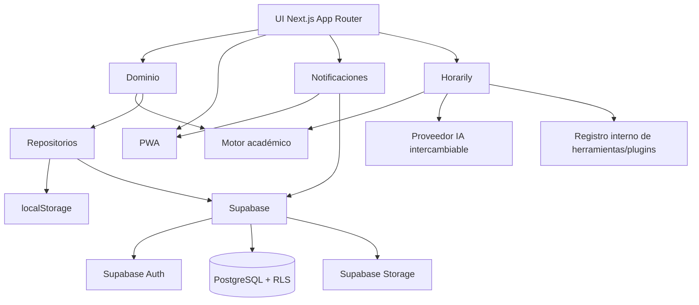

# 01 — Arquitectura actual y objetivo

## Actual

La aplicación usa Next.js App Router con una página cliente principal. El estado se mantiene en React y se persiste en `localStorage`. La lógica académica crítica está en módulos puros de `lib/` para facilitar pruebas.

## Objetivo propuesto

## Tablas preliminares

Todas las entidades privadas deberán incluir `user_id` y políticas RLS por propietario.

- `profiles`: perfil de usuario.
- `semesters`: periodos académicos con escala propia.
- `subjects`: materias y `command_key` único por usuario/semestre.
- `schedule_blocks`: bloques de horario.
- `evaluations`: evaluaciones planificadas.
- `grades`: notas registradas.
- `tasks`: tareas académicas.
- `reminders`: recordatorios.
- `notification_preferences`: preferencias de notificación.
- `activity_events`: bitácora interna.
- `assistant_usage`: uso del asistente.

## Migración futura

La migración desde `localStorage` a Supabase debe ser controlada: respaldo local, validación, vista previa, escritura transaccional por usuario y confirmación antes de borrar o archivar datos locales.
